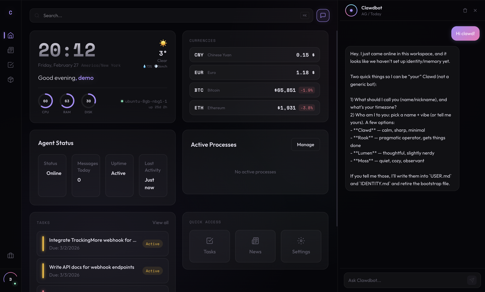
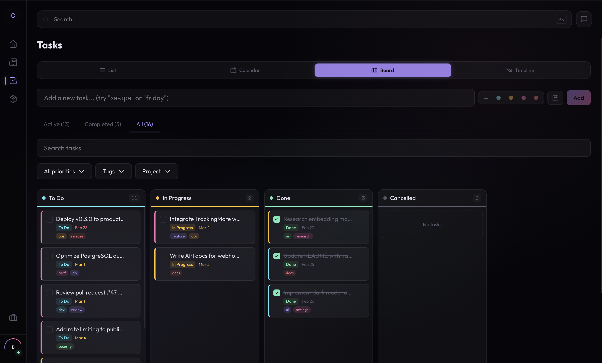
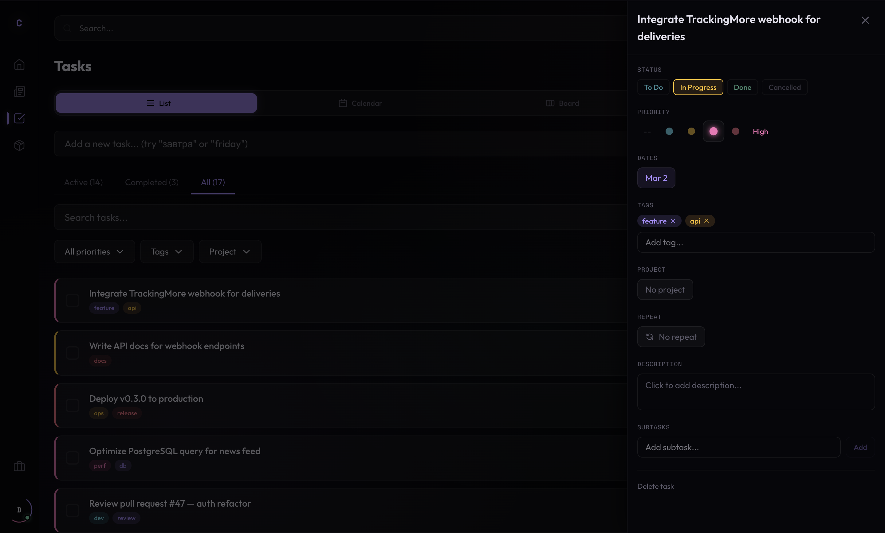
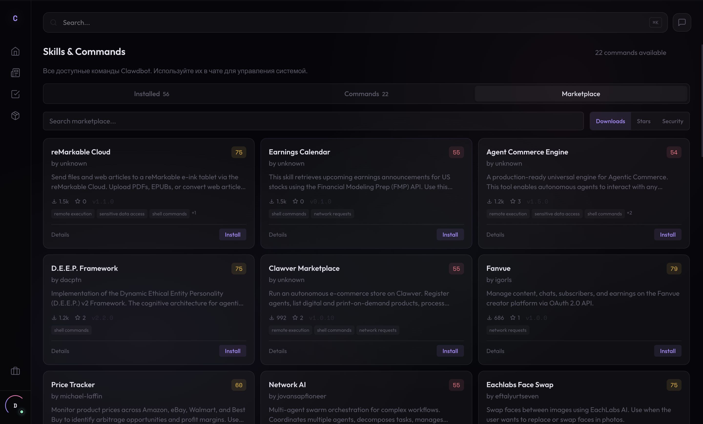

<p align="center">
  <a href="https://github.com/hasanator3000/ClawdOS/stargazers"></a>
  <a href="LICENSE"></a>
  <a href="https://github.com/hasanator3000/ClawdOS/commits"></a>
  
</p>

<h1 align="center">
  ClawdOS
  <br />
  <sub><sup>The web interface for <a href="https://github.com/openclaw/openclaw">OpenClaw</a></sup></sub>
</h1>

<p align="center">
  A full-featured web GUI, dashboard, and productivity workspace for your OpenClaw AI agent.<br/>
  Self-hosted. Private. Your AI assistant that actually <em>does things</em> — not just talks about them.
</p>

<p align="center">
  <a href="#quick-start">Quick Start</a> &middot;
  <a href="#features">Features</a> &middot;
  <a href="#how-it-works">How It Works</a> &middot;
  <a href="#security">Security</a> &middot;
  <a href="INSTALL.md">Install Guide</a> &middot;
  <a href="docs/VISION.md">Vision</a>
</p>

<p align="center">
  
</p>

<p align="center">
  
  
</p>

<p align="center">
  
  
</p>

---

## What is ClawdOS?

**ClawdOS is the web interface for [OpenClaw](https://github.com/openclaw/openclaw)** (formerly Moltbot / Clawdbot) — the open-source personal AI agent with 44K+ stars.

OpenClaw is the brain. **ClawdOS is the eyes and hands.** It gives your OpenClaw agent a full productivity workspace — task management, news feeds, package tracking, dashboards, a skill marketplace — all controlled by AI through natural language.

Think of it as **KDE for your AI agent**: OpenClaw runs in the terminal; ClawdOS gives it a visual operating system.

| Without ClawdOS | With ClawdOS |
|-----------------|--------------|
| Terminal-only interaction | Full web UI + terminal |
| No persistent workspace | Tasks, news, deliveries, dashboard |
| Text responses only | AI executes actions in your workspace |
| Manual skill management | Visual skill marketplace |

> **Looking for an OpenClaw GUI? A Moltbot web interface? A dashboard for your personal AI agent?** This is it.

---

## Quick Start

**Prerequisites:** Node.js >= 22, Docker, [OpenClaw](https://github.com/openclaw/openclaw) running

```bash
git clone https://github.com/hasanator3000/ClawdOS.git && cd ClawdOS
npm install
npm run setup    # creates DB, generates secrets, auto-detects OpenClaw token
npm run dev      # open http://localhost:3000
```

> ClawdOS auto-detects your OpenClaw gateway from `~/.clawdbot/clawdbot.json`. See [INSTALL.md](INSTALL.md) for manual configuration, production deploy, and troubleshooting.

---

## Features

### AI Chat Panel

A streaming chat panel connected to your OpenClaw agent. But it's not just a chatbot — it **acts**. Say *"remind me to call the bank tomorrow, high priority"* and a task appears. Say *"add Hacker News to my feeds"* and it's done. Say *"track my package RR123456789CN"* and it starts tracking. Simple commands resolve in under 1ms thanks to local intent routing — no AI spinner.

### Task Management

Workspace-scoped tasks with priorities (0–4), due dates, tags, projects, and filters. Create them from the UI or by telling your AI. Kanban, calendar, and timeline views.

### News & RSS

Feed reader with custom tabs, full-text search, and 50+ pre-configured sources across AI, tech, crypto, finance, and world news. Add sources by pasting a URL or asking the AI.

### Package Tracking

Track deliveries from 1500+ carriers worldwide (powered by TrackingMore). Add tracking numbers via UI or chat, auto-detect carrier, get live status updates.

### Dashboard

Live greeting, weather, crypto & fiat exchange rates (2-min refresh), system gauges, OpenClaw agent metrics, recent tasks, and quick-access links.

### Skill Marketplace

Browse and install OpenClaw skills from the marketplace. GitHub, Slack, Notion, weather, coding agents, and more. Managed through [ClawdHub](https://clawdhub.com).

### Command Palette

`Cmd+K` — search and jump anywhere: pages, workspaces, actions.

---

## How It Works

ClawdOS connects to your **OpenClaw** agent over a local HTTP gateway (OpenAI-compatible API). ClawdOS handles UI, data, and action execution. OpenClaw handles reasoning, skill execution, and tool use.

```
Browser  ──▶  ClawdOS (Next.js)  ──▶  OpenClaw agent
         ◀──  SSE stream          ◀──  SSE stream
```

### What the AI can do

| Action | Example |
|--------|---------|
| Create, complete, delete tasks | *"create a task to review the PR"* |
| Set task priority | *"mark it as urgent"* |
| Add/remove RSS feeds | *"add TechCrunch to my news"* |
| Create news tabs | *"make a Crypto tab"* |
| Track/remove packages | *"track RR123456789CN"* |
| Navigate anywhere | *"open settings"* |
| Install skills | *"install the GitHub skill"* |

### 3-layer intent routing

Not every message hits the LLM. ClawdOS resolves intents locally first:

1. **Regex** — instant match (< 1ms)
2. **Embeddings** — offline semantic similarity (~6ms, no API call)
3. **OpenClaw LLM** — full reasoning for complex requests

---

## Design

Void-black background. Glassmorphism cards. Neon purple accents. Dark theme only. Fully responsive — works on desktop, tablet, and mobile.

```
 Desktop                            Mobile
 ───────                            ──────
 ┌──────┬──────────────┬────────┐   ┌──────────────┐
 │ Rail │   Content    │  Chat  │   │   Content    │
 │ 64px │    flex      │ resize │   │              │
 │      │              │  drag  │   ├──────────────┤
 └──────┴──────────────┴────────┘   │  Chat sheet  │
                                    ├──────────────┤
                                    │  Tab bar     │
                                    └──────────────┘
```

**Desktop:** Three-column shell — collapsible rail sidebar, flexible content, resizable AI chat panel.
**Mobile:** Bottom tab navigation, swipe-up chat sheet, drawer sidebar. Full feature parity — not a stripped-down version.

Fonts: **Outfit** (UI) + **Space Mono** (code/data).

---

## Security

Built for self-hosting on a private network.

| Layer | Implementation |
|-------|---------------|
| Passwords | Argon2id hashing (GPU-resistant) |
| Sessions | iron-session, httpOnly + sameSite cookies |
| 2FA | Optional Telegram-based OTP |
| Data isolation | PostgreSQL Row-Level Security per workspace |
| AI tokens | Server-side only — never reach the browser |
| Input validation | Zod schemas on every API route and server action |
| Rate limiting | 10 req/sec per IP, sliding window |
| CSRF | Origin header check on all mutations |

> **Do not expose ClawdOS on a public IP.** Use [Tailscale](https://tailscale.com) or an SSH tunnel:
> ```bash
> ssh -L 3000:127.0.0.1:3000 user@your-vps
> ```

---

## Tech Stack

| Layer | Technology |
|-------|-----------|
| Framework | Next.js 16 (App Router, React Server Components) |
| UI | React 19, Tailwind CSS 4 |
| Language | TypeScript 5 (strict) |
| Database | PostgreSQL 16 with Row-Level Security |
| DB Client | Raw `pg` — no ORM, parameterized queries only |
| Auth | iron-session + Argon2id |
| Validation | Zod 4 |
| AI Runtime | OpenClaw gateway (OpenAI-compatible, SSE streaming) |
| RSS | fast-xml-parser |
| ML | @xenova/transformers (offline embeddings for intent routing) |
| Testing | Vitest + Testing Library |

---

## Updates

Built-in update system. Run `npm run update` — fetches latest via git merge, runs migrations, rebuilds, and restarts. Your data and config are never touched. Automatic rollback on failure.

UI banner appears when updates are available. Auto-checks every 6 hours with `auto-host.sh`.

---

## Project Structure

```
src/
  app/(app)/              # Auth-protected pages
    today/                #   Dashboard
    tasks/                #   Task management
    news/                 #   RSS aggregator
    deliveries/           #   Package tracking
    settings/             #   User settings & skills
  app/api/
    ai/chat/              #   OpenClaw proxy + action executor
    currencies/           #   Crypto & fiat rates
    webhooks/             #   External service callbacks
  components/
    shell/                #   App shell, AI panel, command palette
    dashboard/            #   Dashboard widgets
  lib/
    db/repositories/      #   Raw pg queries with RLS
    ai/                   #   Intent routing, actions, streaming
    auth/                 #   Sessions, passwords, 2FA
db/
  schema.sql              # Baseline schema
  migrations/             # Incremental SQL migrations
```

---

## Contributing

See **[CONTRIBUTING.md](CONTRIBUTING.md)** for the full technical guide: architecture, design tokens, project structure, quality gates, and development setup.

Quick links: [RULES/](RULES/) (developer guide, 10 files) | [CLAUDE.md](CLAUDE.md) (AI agent entry point)

---

## Related Projects

- **[OpenClaw](https://github.com/openclaw/openclaw)** — The AI agent runtime that powers ClawdOS
- **[ClawdHub](https://clawdhub.com)** — Skill marketplace and registry for OpenClaw

---

## License

[MIT](LICENSE) — free to use, modify, and self-host. Contributions welcome.
